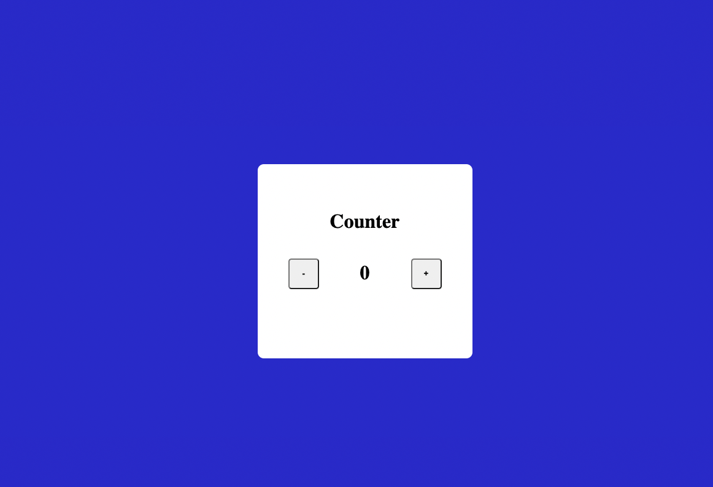

## Hi, I'm Sudhansu Sekhar Mahankuda ! 👋

### 🚀 I'm a front-end developer...

# Basic Counter

- This is a simple project to do, In this project I limited the range of numbers we can move up and down is 10 to -10. Check the app by clicking the below netlify link.

---

- It took me around  30 mins to make this project .

## 🛠 Skills
HTML, CSS, JavaScript

[LinkedIn](https://www.linkedin.com/in/sud-sekhar/)

[Netlify](https://basic-counter-sud.netlify.app/)

